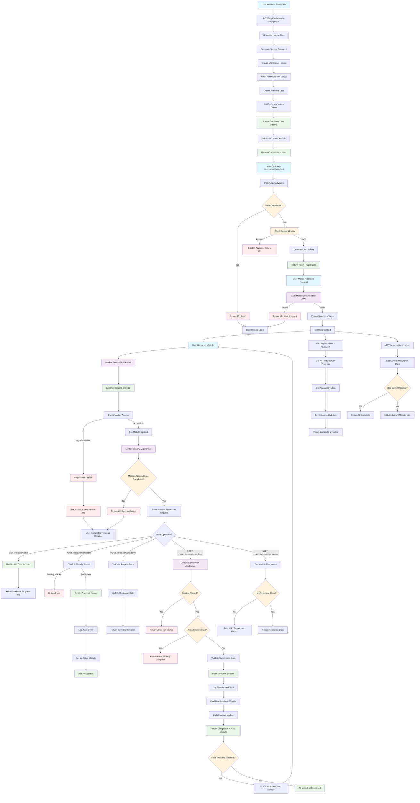

# Utopia User Flow Diagram

This document contains the complete user flow from account creation to module
completion in the Utopia research platform.

## Complete User Journey Flow

## Flow Description

### 🔑 Key Components

#### 1. User Registration Flow

- **Anonymous Account Creation**: Users get unique aliases and temporary
  passwords
- **Firebase Integration**: Secure user management with custom claims
- **Module Initialization**: Automatic setup with consent module

#### 2. Authentication & Authorization

- **JWT-based Authentication**: Secure token-based system
- **Middleware Validation**: Multi-layer security checks
- **Context Management**: User state throughout request lifecycle

#### 3. Sequential Module Access

- **Enforced Progression**: Users must complete modules in order
- **Access Control**: Middleware ensures proper module access
- **Audit Logging**: Complete tracking of user actions and access attempts

#### 4. Module Operations

- **View Module**: Get module details and current progress
- **Start Module**: Initialize module progress tracking
- **Save Progress**: Periodic saving of user responses
- **Complete Module**: Final submission and progression to next module

#### 5. Review Capabilities

- **Access Previous Work**: Users can review completed modules
- **Read-only Access**: Completed modules become viewable but not editable

#### 6. Error Handling & Security

- **Comprehensive Error States**: Clear feedback for various failure scenarios
- **Security Enforcement**: Multiple validation layers
- **User Guidance**: Helpful messages for next steps

### 🎯 Research-Specific Features

- **Anonymous User System**: Protects participant privacy
- **Sequential Access Control**: Ensures research protocol compliance
- **Comprehensive Audit Trail**: Tracks all user interactions for research
  validity
- **Module State Management**: Prevents data loss and ensures research integrity

### 🔄 State Transitions

The diagram shows how users progress through the system:

1. **Registration** → **Authentication** → **Module Access**
2. **Sequential Module Completion** with state validation
3. **Error Recovery Paths** for various failure scenarios
4. **Review Access** for completed modules

This flow ensures research participants follow the intended protocol while
providing a secure and user-friendly experience.
