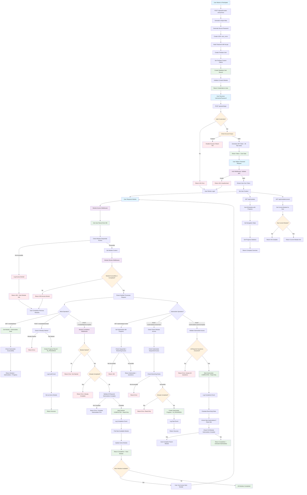
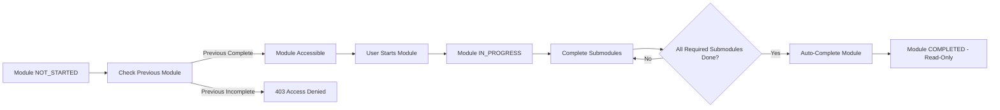
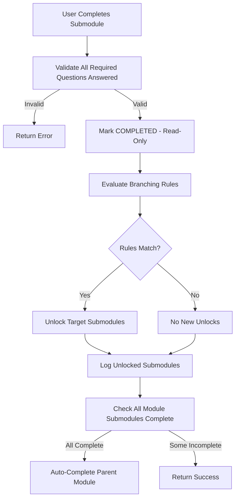
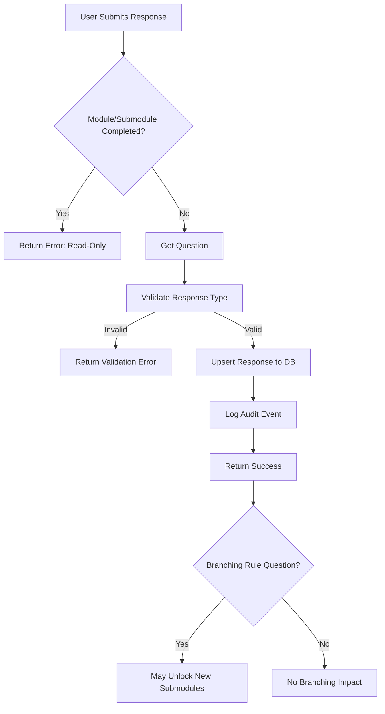
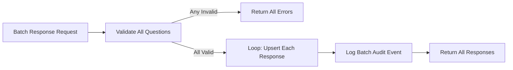
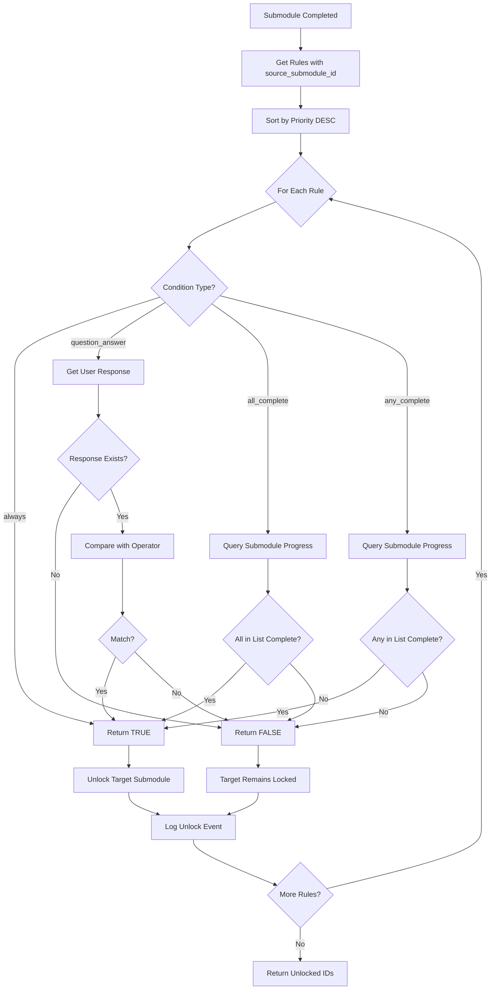
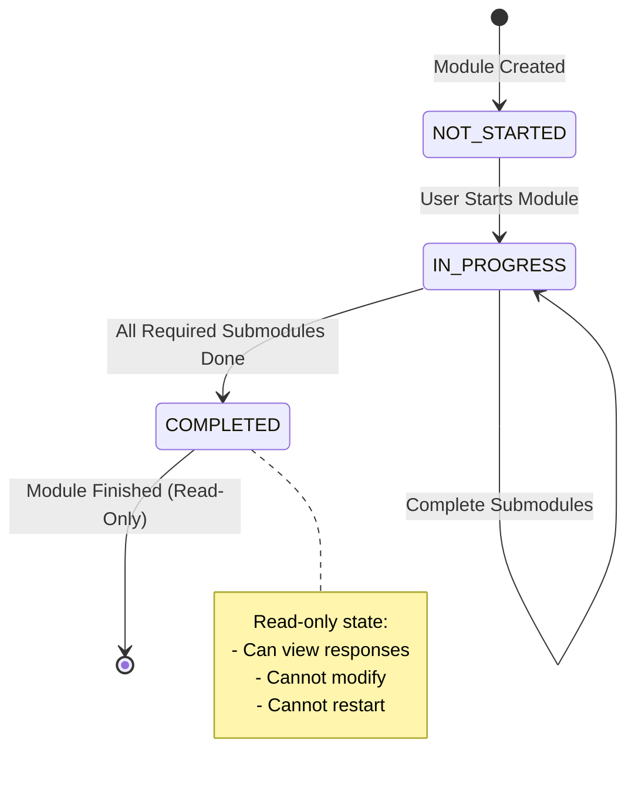
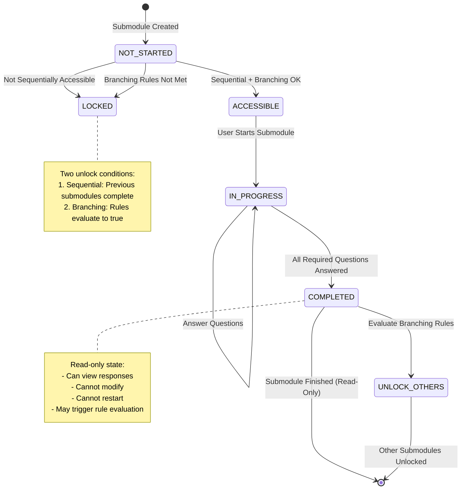
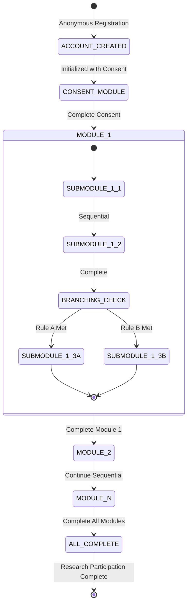

# Utopia User Flow Diagram

This document contains the complete user flow and architecture documentation for
the Utopia research platform, including modules, submodules, questions, and
branching logic.

## Table of Contents

1. [System Architecture Overview](#system-architecture-overview)
2. [Complete User Journey Flow](#complete-user-journey-flow)
3. [Module & Submodule Flow](#module--submodule-flow)
4. [Question & Response Flow](#question--response-flow)
5. [Branching Rules Flow](#branching-rules-flow)
6. [API Endpoints Reference](#api-endpoints-reference)
7. [Middleware Chain](#middleware-chain)
8. [State Transitions](#state-transitions)

---

## System Architecture Overview

### Core Concepts

The Utopia platform implements a hierarchical survey system with adaptive
branching:

```text
Modules (Sequential)
  └─> Submodules (Sequential + Branching)
        └─> Questions (4 Types)
              └─> Responses
                    └─> Trigger Branching Rules
```

### Key Features

1. **Sequential Module Progression** - Users must complete modules in order
2. **Submodule Branching** - Conditional unlocking based on user responses
3. **Question System** - 4 question types with validation
4. **Branching Rules Engine** - Adaptive content paths based on answers
5. **Read-Only Enforcement** - Completed content becomes immutable
6. **Comprehensive Audit Trail** - All actions logged for research compliance

---

## Complete User Journey Flow



---

## Module & Submodule Flow

### Module System Architecture

**Module States:**

- `NOT_STARTED` - Module not yet accessed
- `IN_PROGRESS` - Module started, submodules being completed
- `COMPLETED` - All required submodules completed, module is read-only

**Access Control:**

1. Modules must be completed sequentially (based on `sequence_order`)
2. Previous module must be `COMPLETED` before next is accessible
3. Completed modules become read-only but viewable

**Module Progression Flow:**



### Submodule System Architecture

**Submodule States:**

- `NOT_STARTED` - Submodule not yet accessed
- `IN_PROGRESS` - Submodule started, questions being answered
- `COMPLETED` - All required questions answered, submodule is read-only

**Access Control (Two-Layer):**

1. **Sequential Access** - Previous submodules in same module must be completed
2. **Branching Rules** - May require specific answers to unlock

**Submodule Completion Flow:**



---

## Question & Response Flow

### Question Types

1. **true_false** - Boolean responses
2. **multiple_choice** - Single selection from options
3. **fill_blank** - Short text input
4. **free_form** - Long text input

### Question Organization

- Questions belong to either a **Module** OR a **Submodule** (not both)
- Questions have `sequence_order` for display ordering
- Questions can be `is_required` (must be answered before completion)
- Questions have `metadata` JSONB for type-specific configuration

### Response Submission Flow



### Batch Response Submission

Users can submit multiple responses at once:



---

## Branching Rules Flow

### Branching Rule Types

1. **question_answer** - Unlock based on specific answer to a question
   - Config: `question_id`, `expected_value`, `operator`
   - Operators: `equals`, `not_equals`, `contains`, `greater_than`, `less_than`

2. **all_complete** - Unlock when ALL specified submodules are complete
   - Config: `submodule_ids[]`

3. **any_complete** - Unlock when ANY specified submodule is complete
   - Config: `submodule_ids[]`

4. **always** - Always unlock (no conditions)
   - Config: `{}` (empty)

### Branching Rule Structure

```typescript
BranchingRule {
  source_module_id: number        // Module this rule belongs to
  source_submodule_id: number?    // Submodule that triggers (null = module-level)
  target_submodule_id: number     // Submodule to unlock
  condition_type: ConditionType   // One of 4 types above
  condition_config: object        // Type-specific configuration
  priority: number                // Higher priority evaluated first
}
```

### Rule Evaluation Flow



### Example Branching Scenario

**Scenario**: Educational assessment with remedial path

```text
Module: Math Assessment
├─ Submodule 1: Diagnostic Test (always accessible)
│   └─ Question: "What is 2+2?" (multiple_choice)
│       ├─ Answer "4" → Unlock "Advanced Topics"
│       └─ Answer "3" → Unlock "Fundamentals Review"
├─ Submodule 2: Fundamentals Review (branching)
├─ Submodule 3: Advanced Topics (branching)
└─ Submodule 4: Final Assessment (requires 2 OR 3 complete)
```

**Rules:**

```javascript
// Rule 1: Correct answer unlocks advanced
{
  source_submodule_id: 1,
  target_submodule_id: 3,
  condition_type: "question_answer",
  condition_config: {
    question_id: 42,
    expected_value: "4",
    operator: "equals"
  },
  priority: 10
}

// Rule 2: Wrong answer unlocks review
{
  source_submodule_id: 1,
  target_submodule_id: 2,
  condition_type: "question_answer",
  condition_config: {
    question_id: 42,
    expected_value: "4",
    operator: "not_equals"
  },
  priority: 5
}

// Rule 3: Any path unlocks final
{
  source_module_id: 1,
  target_submodule_id: 4,
  condition_type: "any_complete",
  condition_config: {
    submodule_ids: [2, 3]
  },
  priority: 1
}
```

---

## API Endpoints Reference

### Authentication Endpoints

| Method | Endpoint                     | Description                   | Auth Required |
| ------ | ---------------------------- | ----------------------------- | ------------- |
| POST   | `/api/auth/create-anonymous` | Create anonymous user account | No            |
| POST   | `/api/auth/login`            | Login and get JWT token       | No            |
| POST   | `/api/auth/refresh`          | Refresh JWT token             | Yes           |
| GET    | `/api/auth/user`             | Get current user profile      | Yes           |

### Module Endpoints

| Method | Endpoint                             | Description                   | Auth Required |
| ------ | ------------------------------------ | ----------------------------- | ------------- |
| GET    | `/api/modules`                       | Get all modules with progress | Yes           |
| GET    | `/api/modules/current`               | Get current active module     | Yes           |
| GET    | `/api/modules/:moduleName`           | Get specific module details   | Yes           |
| POST   | `/api/modules/:moduleName/start`     | Start a module                | Yes           |
| POST   | `/api/modules/:moduleName/save`      | Save module progress          | Yes           |
| POST   | `/api/modules/:moduleName/complete`  | Complete a module             | Yes           |
| GET    | `/api/modules/:moduleName/responses` | Get module responses (review) | Yes           |

### Submodule Endpoints

| Method | Endpoint                                               | Description             | Auth Required |
| ------ | ------------------------------------------------------ | ----------------------- | ------------- |
| GET    | `/api/submodules/:moduleName/:submoduleName`           | Get submodule details   | Yes           |
| POST   | `/api/submodules/:moduleName/:submoduleName/start`     | Start a submodule       | Yes           |
| POST   | `/api/submodules/:moduleName/:submoduleName/save`      | Save submodule progress | Yes           |
| POST   | `/api/submodules/:moduleName/:submoduleName/complete`  | Complete submodule      | Yes           |
| GET    | `/api/submodules/:moduleName/:submoduleName/responses` | Get submodule responses | Yes           |

### Question Endpoints

| Method | Endpoint                                             | Description                     | Auth Required |
| ------ | ---------------------------------------------------- | ------------------------------- | ------------- |
| GET    | `/api/questions/modules/:moduleName/questions`       | Get all questions for module    | Yes           |
| GET    | `/api/questions/submodules/:submoduleName/questions` | Get all questions for submodule | Yes           |
| GET    | `/api/questions/:questionId`                         | Get specific question           | Yes           |
| POST   | `/api/questions/:questionId/respond`                 | Submit response to question     | Yes           |
| POST   | `/api/questions/respond/batch`                       | Submit multiple responses       | Yes           |
| GET    | `/api/questions/:questionId/response`                | Get user's response             | Yes           |
| DELETE | `/api/questions/:questionId/response`                | Delete response (testing)       | Yes           |

### Admin Endpoints (Not shown in flows)

Additional endpoints exist for administrative operations like creating/updating
modules, submodules, questions, and branching rules.

---

## Middleware Chain

Requests pass through middleware in this order:

### 1. CORS Middleware

- **Purpose**: Handle cross-origin requests
- **File**: [middleware/cors.ts](utopia/middleware/cors.ts:1)
- **Applied**: Globally on all routes

### 2. Logger Middleware

- **Purpose**: Log all incoming requests
- **File**: [middleware/logger.ts](utopia/middleware/logger.ts:1)
- **Applied**: Globally on all routes

### 3. Auth Middleware

- **Purpose**: Validate JWT token, extract user
- **File**: [middleware/auth.ts](utopia/middleware/auth.ts:1)
- **Applied**: All protected routes
- **Sets**: `c.get("user")` with user data

### 4. Module Access Middleware

- **Purpose**: Check sequential module access
- **File**: [middleware/moduleAccess.ts](utopia/middleware/moduleAccess.ts:1)
- **Applied**: Module-specific routes
- **Checks**: Previous modules completed
- **Sets**: `c.get("module")` with module data

### 5. Module Review Middleware

- **Purpose**: Allow access to completed modules for review
- **File**: [middleware/moduleReview.ts](utopia/middleware/moduleReview.ts:1)
- **Applied**: Module read operations
- **Allows**: Access if module is accessible OR completed

### 6. Module Completion Middleware

- **Purpose**: Validate module can be completed
- **File**:
  [middleware/moduleCompletion.ts](utopia/middleware/moduleCompletion.ts:1)
- **Applied**: Module completion endpoint
- **Checks**: Module started, not already completed

### 7. Submodule Access Middleware

- **Purpose**: Check submodule accessibility (sequential + branching)
- **File**:
  [middleware/submoduleAccess.ts](utopia/middleware/submoduleAccess.ts:1)
- **Applied**: Submodule-specific routes
- **Checks**: Parent module accessible, sequential access, branching rules
- **Sets**: `c.get("submodule")` with submodule data

### 8. Submodule Completion Middleware

- **Purpose**: Validate submodule can be completed
- **File**:
  [middleware/submoduleCompletion.ts](utopia/middleware/submoduleCompletion.ts:1)
- **Applied**: Submodule completion endpoint
- **Checks**: Submodule started, not completed, all required questions answered

### Middleware Chain Example

```text
Request: POST /api/submodules/onboarding/consent/complete
    ↓
[CORS Middleware] → Handle preflight, set headers
    ↓
[Logger Middleware] → Log request details
    ↓
[Auth Middleware] → Validate JWT, set user context
    ↓
[Submodule Access Middleware] → Check parent module, sequential access, branching
    ↓
[Submodule Completion Middleware] → Validate can complete, check questions
    ↓
[Route Handler] → Execute completion logic
    ↓
Response: { progress, unlockedSubmodules, moduleCompleted }
```

---

## State Transitions

### Module State Machine



### Submodule State Machine



### User Progress State Machine



---

## Flow Descriptions

### Complete Module Completion Flow

When a user completes a module with submodules:

1. **User submits completion** via POST `/api/modules/:moduleName/complete`
2. **Module Completion Middleware** validates:
   - Module is started
   - Module not already completed
3. **Module Service checks**:
   - All required submodules are completed
   - If not, returns error with incomplete list
4. **Mark module COMPLETED**:
   - Sets status to COMPLETED
   - Sets completed_at timestamp
   - Module becomes read-only
5. **Log audit event** for completion
6. **Find next accessible module** based on sequence_order
7. **Return response** with:
   - Completion confirmation
   - Next module information
   - Progress statistics

### Complete Submodule Completion Flow with Branching

When a user completes a submodule:

1. **User submits completion** via POST
   `/api/submodules/:moduleName/:submoduleName/complete`
2. **Submodule Completion Middleware** validates:
   - Submodule is started
   - Submodule not already completed
   - All required questions answered
3. **Mark submodule COMPLETED**:
   - Sets status to COMPLETED
   - Sets completed_at timestamp
   - Submodule becomes read-only
4. **Log completion audit event**
5. **Evaluate branching rules**:
   - Get all rules with source_submodule_id matching completed submodule
   - For each rule (sorted by priority):
     - Evaluate condition based on type
     - If condition met, add target_submodule_id to unlocked list
6. **Log unlocked submodules** if any
7. **Check parent module completion**:
   - If all required submodules for parent module are complete
   - Auto-complete the parent module
   - Log module completion event
8. **Return response** with:
   - Submodule completion confirmation
   - List of newly unlocked submodule IDs
   - Whether parent module was auto-completed

### Question Answer with Branching Impact

When a user answers a question that affects branching:

1. **User submits response** via POST `/api/questions/:questionId/respond`
2. **Question Service validates**:
   - Question exists
   - Module/submodule not completed (read-only check)
   - Response value matches question type
3. **Save response** to database (upsert)
4. **Log audit event**
5. **Branching impact** (happens on submodule completion):
   - Response is saved but doesn't immediately unlock
   - When submodule completes, rules are evaluated
   - Rules check this saved response
   - May unlock new submodules based on answer

### Sequential Access Check

When a user tries to access a submodule:

1. **Submodule Access Middleware** checks:
   - Parent module is accessible (previous modules complete)
   - Previous submodules in same module are complete
2. **Branching Rules Check**:
   - Get all rules targeting this submodule
   - If no rules exist, submodule is accessible
   - If rules exist, evaluate each:
     - ANY rule evaluating to TRUE unlocks submodule
     - ALL rules must be FALSE to keep locked
3. **Combined result**:
   - Both sequential AND branching must pass
   - If either fails, return 403 Access Denied

---

## Research-Specific Features

### Anonymous User System

- Unique aliases generated (adjective-noun pattern)
- Temporary passwords (expires after 30 days)
- UUID-based identification
- Firebase integration for auth

### Sequential Access Control

- Enforced module progression
- Prevents skipping ahead
- Ensures research protocol compliance

### Comprehensive Audit Trail

- All user actions logged
- Module start/completion events
- Question responses timestamped
- Access attempts tracked

### Module State Management

- Prevents data loss with progress tracking
- Read-only completed content ensures data integrity
- Progress can be saved incrementally

### Branching Logic for Research

- Adaptive content paths based on responses
- Complex conditional logic support
- Priority-based rule evaluation
- Multiple condition types for flexibility

---

## Error Handling & Security

### Common Error Responses

| Status | Scenario                 | Response                                                 |
| ------ | ------------------------ | -------------------------------------------------------- |
| 401    | Invalid/expired JWT      | `{ error: "Unauthorized" }`                              |
| 403    | Module not accessible    | `{ error: "Module not accessible", next_module: {...} }` |
| 403    | Submodule locked         | `{ error: "Submodule not accessible" }`                  |
| 400    | Module already completed | `{ error: "Module already completed - read-only" }`      |
| 400    | Invalid response type    | `{ error: "Invalid response", details: {...} }`          |
| 404    | Resource not found       | `{ error: "Not found" }`                                 |
| 500    | Server error             | `{ error: "Internal server error" }`                     |

### Security Features

1. **JWT Authentication** - 30-day token expiration
2. **Password Hashing** - bcrypt with salt rounds
3. **Firebase Integration** - Custom claims for role-based access
4. **Middleware Validation** - Multi-layer access checks
5. **SQL Injection Prevention** - Parameterized queries with Neon
6. **Type Validation** - Zod schemas for request validation
7. **Read-Only Enforcement** - Completed content immutable
8. **Audit Logging** - All actions tracked

---

## Summary

The Utopia platform implements a sophisticated hierarchical survey system with:

- **Sequential module progression** ensuring research protocol compliance
- **Adaptive submodule branching** based on user responses
- **Comprehensive question system** with 4 types and validation
- **Flexible branching rules engine** with 4 condition types
- **Multi-layer middleware security** ensuring proper access control
- **Complete audit trail** for research integrity
- **Read-only enforcement** preventing data tampering
- **Anonymous user system** protecting participant privacy

This architecture supports complex research protocols while maintaining
security, data integrity, and a user-friendly experience.
